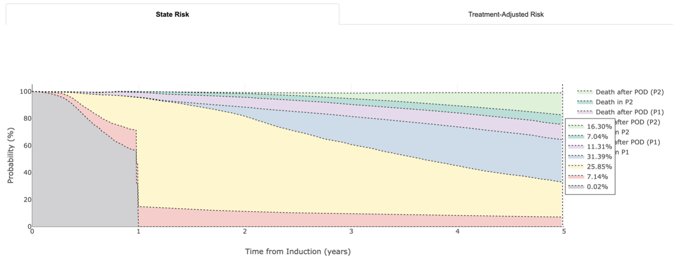

# Overview

  

# User guide for website

The website is a tool for research and can be accessed at https://irmma-risk-calculator.miami.edu

For a detailed breakdown of the dataset across various states included in our knowledge bank, please refer to Figure 3a in the paper.

For query suggestions based on what IRMMa has seen and learned from,

  

## IRMMa Risk Calculator manual

### Calculate risks according to an individual’s characteristics 

* Please first complete the Attribute Form which is the set of features used to calculate multistate/treatment risks.   *Age* (*Demographics*), *ISS*, and Induction (Phase 1) (*Therapy*) are **mandatory fields**.   **If there is no selection** on *IGH-Translocations* or *Genomics*, the **default is NA**. 
* When you have completed your selections, press the **Submit** button. Of note, the threshold for  minimum number of cases that IRMMa utilizes to make a prediction is 1.

**Once submitted, IRMMa calculates risks and the following is displayed:**

* **State Risk** - Multistate risks from start of P1 up until 5 years.
* **Treatment-Adjusted Risk** - Risk of POD and/or death at 5 years based on selected and alternative P1 treatment combinations and P2 treatments, MAINT/CONT.TREAT and HDM-ASCT.

### For interpretation of risks
**Please refer to figure below, where the risks are of the query with respect to the knowledge bank scores.**

  

## Example

**IRMMa web interface provide individualized risk estimates for each patient.** 
* As reported above IRMMa´s knowledge bank predictions of probabilities at 5 years to be alive range from 40 to 80%, 10 to 55% to be in free of POD and 5-47% to be alive in remission.
* A risk of being in remission and alive at 5 years of 50% might seem low and concerning, but it is actually sign of very favorable outcomes according to IRMMa performances and distribution of risk across different states. 
* In fact, we see IRMMa's highest EFS to be 55%. 

### State Risk
* Example of the different states for a given query/profile. Moving the mouse cursor along the x-axis provides probabilities across states over time.

  

### Treatment-Adjusted Risk
* Example of alternative therapies for the given profile and their associated risks.

  

### Low & High risk profile predictions
**Below we summarize two examples: one for a low and another for a high risk patient.**

<table><tr>
<td> 
  

    
    
  
 
</td>
<td> 
  

    
    
  
 
</td>
</tr></table>

| Low | High |
| --- | --- |
| Patient with newly diagnosed multiple myeloma, <65 years old, ISS1, hyperdiploid, with del13q and t(11;14)(CCND1;IGH) without any high-risk features. The probability to be alive and in remission are higher than the high risk case and within the 4th quartile of our distribution of risk, reflecting a favorable outcome.   Looking at the treatment variance results, IRMMa predicts that this patient might benefit from consolidation strategies, in particular with HDM-ASCT. | Patient is newly diagnosed multiple myeloma, with age>75 years, ISS3, high APOBEC and presence of chromothripsis treated with lenalidomide dexamethasone.   For this patient the probability of being alive and in remission at 5-years is 25.85% vs 66.14% of being progressed. Therefore reflect a high-risk disease. |

## Acronyms/definitions

* **IRMMa** - Individualized Risk Model for Myeloma.
* **MAINT/CONT.TREAT (M.C.T.)** - Maintenance/continuous treatment (Defined as either maintenance therapy continuing after induction or a treatment lasting more than 12 months, Palumbo et al. JCO 2015).
* **CHEMO** - Any chemotherapy regiment received except high-dose melphalan. This includes cyclophosphamide, low-dose melphalan, or any platinum-based chemotherapy.
* **HDM-ASCT** - High-dose melphalan followed by autologous stem cell transplantation.
* **Induction, Phase 1 (P1)** - Induction treatment within 1 year.
* **Post-Induction, Phase 2 (P2)** - Addition of HDM-ASCT and/or MAINT/CONT.TREAT or neither upon completion of P1 (without POD).
* **POD** - Progression of Disease.
* **Probability of being alive** - Probability of *Alive in P1 + Alive after POD (P1) + Alive in P2 + Alive after POD (P2)*.
* **Probability of POD** - Probability of *Alive after POD (P1) + Alive after POD (P2) + Death after POD (P1) + Death after POD (P2)*. 
* **Risk of POD and/or deceased** - Probability of *Alive in P1 + Alive after POD (P1) + Death after POD (P1) + Death in P2 + Alive after POD (P2) + Death after POD (P2)*.
* In **Treatment-Adjusted Risk** plot, for each therapy $i$ where $i$ are all the combination therapies that is present in our knowledge bank, we provide the variance **var (%)** as the difference in risk between query ${q}$ selected therapy in P1, P2 and alternative therapy $i$. $var = {risk_i - risk_q \over risk_q}\times100$. Thus negative var indicates reduced risk of POD and/or death in comparison to query selected therapy, positive indicates worse risk of POD and/or death, 0 indicates risk of query $q$. 

## More Information
* [Data preparation and genomic classification](https://github.com/UM-Myeloma-Genomics/GCP_MM/tree/main/genomic)
* [IRMMa](https://github.com/UM-Myeloma-Genomics/GCP_MM/tree/main/prognostication)

